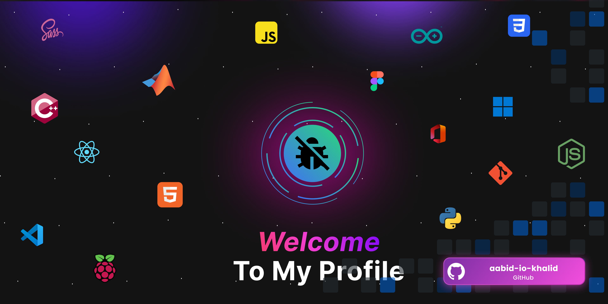

# 👨‍💻 Khalid Abid | Full Stack Developer

## 💫 About Me

- 🔭 I'm currently working on **various web development projects, exploring both front-end and back-end technologies**
- 🌱 I'm studying at **YouCode, focusing on full-stack development**
- 👯 I'm looking to collaborate on **JavaScript, PHP, web applications, and back-end development**
- 💬 Ask me about **HTML, CSS, JavaScript, PHP, C programming, GitHub, and web development best practices**
- ⚡ Fun fact: **I started coding in C before transitioning to web development, and I love exploring how different programming languages connect!**

## 🌐 Connect With Me

  

    
    
  

  

    
  

### Languages

### Frameworks & Libraries

### Tools & Platforms

### Databases & Servers

## 📊 GitHub Stats

<table>
  <tr>
    <td>
      
    </td>
    <td>
      
    </td>
  </tr>
</table>

  

## 🏆 GitHub Trophies

## 🐍 Contribution Graph
<picture>
  <source media="(prefers-color-scheme: dark)" srcset="https://raw.githubusercontent.com/aabid-io-khalid/aabid-io-khalid/output/github-snake-dark.svg" />
  <source media="(prefers-color-scheme: light)" srcset="https://raw.githubusercontent.com/aabid-io-khalid/aabid-io-khalid/output/github-snake.svg" />
  
</picture>
